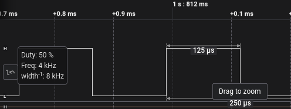

# Control de led mediante señal PWM usando hardware (LEDC)

Este proyecto esta basado en la documentacion del espressif para el manejo del periferico LEDC[docs page](https://docs.espressif.com/projects/esp-idf/en/stable/esp32/api-reference/peripherals/ledc.html)

### Introduccion 

El periférico de control de LED (LEDC) está diseñado principalmente para controlar la intensidad de los LED, aunque también se puede utilizar para generar señales PWM para otros fines. Tiene 8 canales que pueden generar formas de onda independientes que pueden usarse, por ejemplo, para controlar dispositivos LED RGB.

Los canales LEDC se dividen en dos grupos de 8 canales cada uno. Un grupo de canales LEDC opera en modo de alta velocidad. Este modo se implementa en hardware y ofrece un cambio automático y sin fallas del ciclo de trabajo de PWM. El otro grupo de canales opera en modo de baja velocidad, el controlador debe cambiar el ciclo de trabajo PWM en el software. Cada grupo de canales también puede utilizar diferentes fuentes de reloj.

El controlador PWM puede aumentar o disminuir automáticamente el ciclo de trabajo de forma gradual, lo que permite atenuaciones sin interferencia del procesador.

### Pasos a seguir
En este ejemplo simple vamos a control la intensidad de un led mediante los drivers ledc. Para ello debemos realizar una seria de pasos:
- Configurar el temporizador ha utilizar.
- Configurar el canal o los canales a utilizar.
- Llamar a la funcion que genera el PWM.
- Actualizar el tiempo de trabajo del PWM (duty cycle).

## Imagenes

### Mediciones con Analizador Lógico

#### Circuito Implementado

## Requisitos

Para ejecutar estos ejemplos, necesitarás un entorno de desarrollo configurado para la programación de la ESP32, que puede incluir:

- Placa de desarrollo ESP32.
- SDK de Espressif (IDF-ESP32).